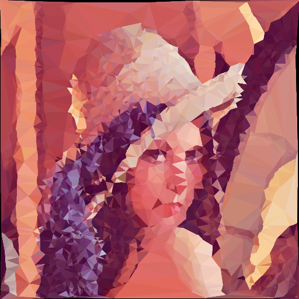

# kantig - create low-poly images

Create low-poly images in your command line. This program has a variety of options and allows the use of stdin/stdout for tons of scripting potential.

## Installation

To build this program, [install rust](https://www.rust-lang.org/tools/install) first. Then, clone this project and run `cargo build --release`. The final binary will be in `target/release/kantig` and can be moved into your binary folder.

## Invokation

Calling kantig is as easy as `kantig -o output.png input.png`. By omitting the input or output file you can instruct kantig to use stdin/stdout. An example would be `curl https://i.redd.it/ub4dywjkj9k51.jpg | kantig | display -`. You can also tweak the quality using the different command line options listed below.

## Documentation

To access the documentation either just open the code or run `cargo doc --open`.

## How does it work?

kantig works by applying an edge detection algorithm to the image. It picks the points which were detected as edges, takes a random sample containing a certain amonut of points that you can specify, removes points too close to each other, uses the delaunay triangulation to produce a mesh of triangles and draws the triangles onto a new image.

## Command line options

When in the command line you can run `kantig --help` to get the same listing.

Option | Default | Description
------------ | -------------
`-o`/`--output` | `-` | The output filename. kantig tries to auto-detect the output format from the filename (this can be overwritten with `--output-format`). If not present stdout will be used.
`--output-format` | `png` | The format of the produced image. This has to be the name of the file extension of a format supported by the [image crate](https://docs.rs/image/0.23.9/image/). Examples are `png`, `jpg` and `bmp`.
`--points-min-distance` | `4` | Enforce points used for triangulation to have a distance of X pixels to each other or more
`--rng-seed` | nothing | The seed for the RNG. This can be a number between 0 and 2^16-1 inclusive
`--canny-lower` | `10.0` | The lower bound for the image detection algorithm
`--canny-upper` | `15.0` | The upper bound for the image detection algorithm
`--color-mapper` | nothing | A shell program to change the polygon colors used by kantig. This feature is in its alpha state, for now look it up in the documentation. This will change in the future. See the file rainbow_color_mapper.py for an example.

### Specifying the number of points

There are three ways of specifying how many points kantig uses for the triangulation. Those are mutually exclusive. Note that the removal of close points happens after this, so you might end up with less points than you specified.

Option | Description
`--points` | Use an absolute number of points
`--points-relative` | Use a number of edge points relative to the number of edge points found. `0.0` means no points are used and `1.0` means all points are used
`--points-pixel-relative` | Use a number of edge points relative to the number of pixels in the image

These options exist to allow kantig to work with images of different sizes more seamlessly. By default kantig assumes `--points-relative 0.04`.

